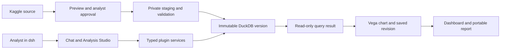

# dsh-data-analyst

A local data-analysis plugin for [DeepSeek Harness](https://github.com/deepseek-ai/deepseek-harness).
Import reviewed **tabular** Kaggle sources into DuckDB, ask analytical questions,
customize charts in the **Analysis Studio** sidebar, and save dashboards and
browser reports.

## What you can do

- Search Kaggle and preview CSV, Parquet, JSON/JSONL or XLSX sources.
- Review column types in a grid, recover unsaved drafts and approve ingestion.
- Query immutable dataset versions with controlled, read-only SQL, or answer common
  analytical shapes without writing SQL: summarise one approved column's
  distribution (counts, null share, min/max, mean, median, quartiles, per group if
  asked), count full-row duplicates, bin an elapsed-seconds column into intervals,
  or take one ratio of two summed columns with the incomplete-pair rule stated.
- Explore saved results; edit chart types, labels, colours and filters directly.
- Pin specific analysis revisions to dashboards; apply, replace and clear mapped filters.
- Open persistent report cards or export offline HTML, CSV, SVG, PNG and report packs;
  the report's Downloads include the analysis **spec/JSON**, so the exact SQL and revision
  travel with the export and you can continue in your own tooling.

Real output, no install: [an exported report and three charts](docs/examples/) from a
live session on a 7,740,126-row dataset, committed unedited.

Storage types do not establish business meaning. The analyst approves metric
definitions and cleaning decisions. Legacy XLS, SQLite source files, non-tabular
sources, multi-user access and enterprise BI features are outside current support.

## Get started

You need Node 24, pnpm 11.7.0, `uv` and a dsh installation matching the
[compatibility pin](profiles/data-analyst/upstream-lock.json). If you build that
harness from source, run its `install` **and `build`** steps: the web UI's client
bundles are build output, and `dsh web` refuses to serve without them. On Apple
Silicon build for arm64 (see [setup](docs/analyst-setup.md#2-install-the-plugin-into-dsh-web)). Live chat needs a
DeepSeek API key; Kaggle preview/download needs your own Kaggle account token and
the [pinned CLI](tools/kaggle-cli/README.md) (below). **Builds and the default
test suite (`pnpm check`) need neither key.** Tested on macOS and Linux (CI
covers both, x64 and arm64); see [analyst setup](docs/analyst-setup.md#prerequisites)
for the full prerequisites table and Windows guidance.

### Before the first run

Follow these in order — step 3 (Kaggle) must be done before you reach the first
conversation, or the agent's first preview will prompt for credentials you
haven't set up yet.

**1. Clone, install, build.**

```sh
pnpm install --frozen-lockfile   # pnpm 11.7.0 — pinned via package.json#packageManager
pnpm build
```

**2. Install the plugin into dsh's `web` profile and configure the preset.**

```sh
export DSH_HOME="$HOME/.dsh"
export DSH_DATA_WORKSPACE="$HOME/.local/share/dsh-data-analyst"
mkdir -p "$DSH_DATA_WORKSPACE"

dsh --profile web --dump-config >/dev/null
dsh plugin --profile web add "$PWD"
pnpm configure:analyst-profile --profile web --home "$DSH_HOME"
```

**3. Set up the pinned Kaggle CLI and your Kaggle token.**

```sh
cd tools/kaggle-cli && uv sync && cd ../..    # pinned kaggle==2.2.4 venv

mkdir -p ~/.kaggle
# Create an API token at https://www.kaggle.com/settings/api, then write the
# one-line token string (only the token — no username, no JSON) into:
#   ~/.kaggle/access_token
chmod 600 ~/.kaggle/access_token

# Proves the token actually works, without ever printing it:
tools/kaggle-cli/.venv/bin/kaggle datasets list -s superstore
```

Notes, from testing this directly:

- Auth is **token-only** — no Kaggle username is required or read by our code.
  `export KAGGLE_API_TOKEN=...` (the token value, or a path to the token file)
  works the same as the file.
- Never paste your token into chat, a commit, or an issue. Nothing in this
  repository's code, logs or tool output ever prints, stores or forwards it —
  `pnpm doctor` and the product's own error messages report only
  presence/absence and the fix command, never the value.
- `DSH_KAGGLE_EXECUTABLE` overrides the resolved CLI path — set it only when
  you deliberately want a different `kaggle` install than the pinned venv.
- If the venv above wasn't created, the product's own preflight check fails
  closed with: `Pinned Kaggle CLI executable not found. From the repo root
run: cd tools/kaggle-cli && uv sync. Or set DSH_KAGGLE_EXECUTABLE to an
absolute path for an installed kaggle binary.` — re-run `uv sync`.
- `pnpm doctor` reports Kaggle CLI and token presence/absence with the exact
  fix for each, before you even open dsh.

**4. Start dsh and load the analyst preset.**

```sh
# Load DEEPSEEK_API_KEY securely into the environment before starting.
dsh --profile web --host 127.0.0.1 --port 3080 --no-open
```

Open the token URL printed by dsh. On a fresh `DSH_HOME` the harness shows an
**Internal Testing Notice** dialog first — click **Continue**; until you do, the
composer silently ignores input. Then select the **Analyst data** workspace and
the **Data analyst (isolated)** preset. Then try:

> Preview `vivek468/superstore-dataset-final` so I can review its columns.

Approve the proposal in the sidebar, then ask to ingest and analyse it.
`/analyst-reviews`, `/analyst-explore`, `/analyst-dashboard` and `/analyst-report`
open direct controls without a model turn.

[Analyst setup](docs/analyst-setup.md#first-session) walks that first session end to
end — what to approve and why, the questions worth asking before you trust a number,
how to iterate on a chart, and where the agent is expected to push back. Prompts you
can paste straight in, with what to expect after each. Follow it for harness setup and
troubleshooting too; reuse the same dsh home and data workspace across restarts.

Budget: a measured end-to-end first session (preview → approve → ingest → query →
chart → mark-only change → save → dashboard → report) used **~657K tokens across
5 turns** on a 25,000-row CSV; the same arc on a 392 MB / 7,740,126-row CSV previewed
in 20s, ingested in about 30s, with individual analysis questions answering in
9–52s. Previews and profiling dominate; direct Studio controls cost nothing.

### Expected behaviour that can look like a failure

- A chart the deterministic layout validator rejects, reported as rejected, is
  the product working correctly — not a bug
  ([viz-conventions skill](skills/viz-conventions/SKILL.md)).
- Generated interpretation is always flagged as needing analyst review; it is
  never presented as verified fact.
- Shareable report exports are **facts-only**: generated interpretation is left
  out and the report says so ("Interpretation review: unreviewed"). Approve an
  interpretation in Studio if you want narrative included.
- An unresolved business term (e.g. "revenue") is asked back to you rather
  than silently assumed.
- Legacy XLS, SQLite and non-tabular Kaggle sources are refused explicitly,
  with a stated reason — this is not a partial-import bug.
- An unknown dataset licence is surfaced for you to accept before ingest, not
  silently allowed or silently blocked.
- A histogram's bin count and width come from the chart template (Vega-Lite's default
  binning). That is a rendering choice, not a measurement the agent invented — ask for
  explicit bins (e.g. "1 percentage-point bins") when you need to quote bin counts.
- A query that reads a date column still held as text comes back with a
  `text-date-risk` warning: comparisons, `BETWEEN`, `ORDER BY` and `MIN`/`MAX` answer
  lexicographically there. Treat the warning as the reason to set the format and
  re-ingest, not as a caveat on a usable number. The check is not exhaustive — a
  missing warning is not proof a read is sound — and the undocumented shapes are
  listed in the [sql-safety skill](skills/sql-safety/SKILL.md).
- A review that says **"This proposal changed elsewhere"** is protecting unsaved work
  you still hold; the server rejects a stale approval rather than applying it to a
  revision you never saw. Save or discard, then reload.
- Re-previewing a source that already has a _pending_ candidate reuses it (no
  re-download) and says so (`reusedCandidate: true`, at the version it pinned). That
  reuse never overwrites a candidate you may have edited, so it will not pick up a
  newer Kaggle release by itself — name the version when the newest matters.
- If a chart you explicitly asked to be vertical was rendered horizontal to stay
  readable, the answer is expected to say so. The refinement record marks the
  override (`overrodeRequestedFormat`) and the tool description tells the agent to
  disclose it. See [current status](docs/implementation.md).

## Verify it yourself, without credentials

Nothing below needs a DeepSeek API key or a Kaggle token, and none of it calls a
model — so the behaviour is reproducible rather than claimed. If you would rather look
before you run anything, [docs/examples](docs/examples/) holds a real exported report
and three real charts:

```sh
pnpm check              # docs links, distribution, lint, format, types, unit + integration tests
pnpm eval:refusal       # 14-case clarification/refusal policy: an unresolved term is asked back, never assumed
pnpm eval:visual-layout # chart layout validator, including the shapes it must reject
pnpm eval:versatility   # 16 messy-tabular cases through the real ingest -> query pipeline
```

`eval:versatility` is the one to watch if you want to judge the ingestion claims:
it generates adversarial fixtures at run time (no data ships with this repo) and
asserts the documented contract for each — a column whose type changes thousands of
rows past the sampling window, duplicate and blank header labels, RFC4180 quoted
fields, a merged Excel title banner, a multi-table source with no declared keys,
many-currency columns, windows-1252/UTF-16/per-record mixed encodings, a
several-hundred-column table, a few-hundred-thousand-row table, inconsistent dates,
an all-NULL column, full-row duplicates and leading-zero identifiers. Each case
either produces a correct result or an explicit refusal naming the reason and the
next step; a case that finds behaviour weaker than the docs claims fails the gate
rather than being quietly satisfied.

## How it works



dsh owns the single reasoning loop, sessions and browser UI. Our plugins own
controlled ingestion, query policy, metadata, charts and exports. SQLite stores
mutable workflow state; DuckDB stores versioned analytical data. Services enforce
policy independently of skill instructions. Read the
[architecture and rationale](docs/architecture.md) for the boundaries and tradeoffs.

## Current limitations

- **One analyst, one machine.** The security model is a single trusted analyst
  on loopback; there is no multi-user access, row-level security or
  Internet-facing deployment.
- **Tabular Kaggle sources only.** CSV, Parquet, JSON/JSONL and XLSX are
  supported. Legacy XLS, SQLite files and non-tabular Kaggle content (images,
  audio, text corpora, pretrained-model archives) are not — ingestion reports
  this explicitly rather than attempting a partial import.
- **Query success is not business correctness.** A successful cast or an
  executable SQL statement doesn't by itself establish uniqueness,
  missingness, distribution shape or trustworthy labels. Generated
  interpretation still needs analyst review before you rely on it.
- **Analysis Studio edits one table at a time.** Multi-table joins, brushing
  and arbitrary field roles are deliberately out of scope, and series color
  encoding is capped at 20 values.

See [current status and remaining work](docs/implementation.md) for the
complete list, including narrower edge cases and tool-surface backlog items.

## Possible future improvements for the custom agent

These are real, currently-open gaps in the Data analyst agent itself — its
tool surface, skills and measured behavior — worth building toward next,
distinct from the limitations above:

- **Prove Learning v1.1 actually helps.** The agent can already record an
  analyst's correction and retrieve it later, but no held-out test has yet
  shown that a stored correction changes a _later, different_ answer for the
  better. Closing that would turn "the plumbing exists" into "the agent
  demonstrably gets better from feedback."
- **Stabilize the live gate's verdict.** Live runs now clear the accuracy gate,
  but a later one cleared every bar and still reported the gate false on
  incomplete telemetry, after a single case exhausted its tool-call budget. Two
  things would make the verdict trustworthy rather than fragile: approve the eval
  workspace's relationships so the reconciliation case can use the
  `reconcile_totals` path the skill directs it to (it fails closed today), and
  widen the gradable chart set, which is currently narrow enough that a single
  case decides the outcome.
- **Wire more analytical recipes in as tools.** A handful of recipe kinds
  (descriptive statistics, full-row-duplicate-excess, elapsed-intervals,
  ratio-of-sums) already exist and pass in the eval harness but aren't yet
  exposed as model-facing tools — turning them into first-class tools would
  widen what the agent can answer directly instead of composing raw SQL.
- **Grow bounded UI coverage deliberately.** Multi-table joins, brushing and
  a higher series-color cap are all currently out of scope by choice, not by
  accident. If analyst usage shows a real repeat need, these are the next
  places to extend the Studio surface without turning it into a general BI
  editor.

## Repository map

- `packages/`: shared core and four managed capability plugins.
- `profiles/data-analyst/`: dsh bundle, isolated preset and upstream version pin.
- `skills/`: four workflow skills with packaged references and tested service support.
- `scripts/`: setup, packaging, diagnostics and integration helpers.
- `tests/`: synthetic fixtures and cross-package tests.
- `docs/`: current user, architecture, development and verification guides.
- `deployment/`: local operation and backup/restore instructions.

## Develop

```sh
pnpm check
pnpm build
```

The default check covers documentation, public-distribution checks, lint,
formatting, types and tests. GitHub Actions runs it on Linux and macOS.
No dataset archives, credentials, generated reports or local dsh homes belong in Git.

- [Documentation index](docs/README.md)
- [Contributing](CONTRIBUTING.md)
- [Security policy](SECURITY.md)
- [Current status and remaining work](docs/implementation.md)

Licensed under [MIT](LICENSE). Dataset licenses are separate, and one vendored
browser asset ships under its own license — see
[THIRD_PARTY_NOTICES](THIRD_PARTY_NOTICES.md). The repository is
installed as a local dsh plugin bundle; `private: true` prevents accidental npm
publication and does not prevent public GitHub distribution.
